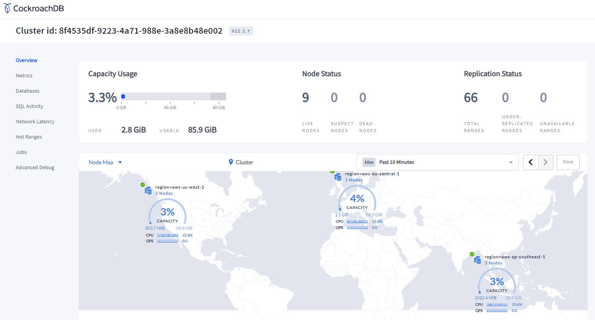

# Data Domiciling Demo

- [Data Domiciling Demo](#data-domiciling-demo)
- [Setup](#setup)
  - [Cluster Setup](#cluster-setup)
  - [Enable the Node Map in the DB Console](#enable-the-node-map-in-the-db-console)
  - [Licenses and Cluster Settings](#licenses-and-cluster-settings)
  - [Nodes in the Cluster](#nodes-in-the-cluster)
  - [Create the Databases](#create-the-databases)
    - [Abstractions Database](#abstractions-database)
- [Global Tables](#global-tables)
- [Regional Tables - Zone Survival Goal](#regional-tables---zone-survival-goal)
  - [DDL](#ddl)
  - [Test Data](#test-data)
  - [Regional Tables Review](#regional-tables-review)
- [Regional-By-Row Tables](#regional-by-row-tables)
  - [What Ranges are my rows in and where are those ranges?](#what-ranges-are-my-rows-in-and-where-are-those-ranges)
  - [What if I change the crdb_region on a row?](#what-if-i-change-the-crdb_region-on-a-row)
    - [Before](#before)
    - [After](#after)
  - [Backup and Restore Domiclied Data](#backup-and-restore-domiclied-data)
    - [Backups](#backups)
    - [Restore](#restore)
- [Limitations](#limitations)
  - [Indexes](#indexes)
    - [Prep](#prep)
    - [Create Index](#create-index)
- [Appendix](#appendix)

---
# Setup 

** All data in this demo was created with Python/Faker.  None of the names, national IDs, etc. are real.  

## Cluster Setup
AWS EC2 Hosted 9 Node, 3 Region Cluster with 3 nodes in each region, all nodes in separate AZs.  



## Enable the Node Map in the DB Console
The data you enter here, must map to the localities you used when starting each node.  If you are using CockroachDB Dedicated, you do not need to perform this step.    These are the localities I used for 
```
INSERT into system.locations VALUES ('region', 'aws-us-east-1', 37.478397, -76.453077);
INSERT into system.locations VALUES ('region', 'aws-us-east-2', 40.417287, -76.453077);
INSERT into system.locations VALUES ('region', 'aws-us-west-1', 38.837522, -120.895824);
INSERT into system.locations VALUES ('region', 'aws-us-west-2', 43.804133, -120.554201);
INSERT into system.locations VALUES ('region', 'aws-ca-central-1', 56.130366, -106.346771);
INSERT into system.locations VALUES ('region', 'aws-eu-central-1', 50.110922, 8.682127);
INSERT into system.locations VALUES ('region', 'aws-eu-west-1', 53.142367, -7.692054);
INSERT into system.locations VALUES ('region', 'aws-eu-west-2', 51.507351, -0.127758);
INSERT into system.locations VALUES ('region', 'aws-eu-west-3', 48.856614, 2.352222);
INSERT into system.locations VALUES ('region', 'aws-ap-northeast-1', 35.689487, 139.691706);
INSERT into system.locations VALUES ('region', 'aws-ap-northeast-2', 37.566535, 126.977969);
INSERT into system.locations VALUES ('region', 'aws-ap-northeast-3', 34.693738, 135.502165);
INSERT into system.locations VALUES ('region', 'aws-ap-southeast-1', 1.352083, 103.819836);
INSERT into system.locations VALUES ('region', 'aws-ap-southeast-2', -33.86882, 151.209296);
INSERT into system.locations VALUES ('region', 'aws-ap-south-1', 19.075984, 72.877656);
INSERT into system.locations VALUES ('region', 'aws-sa-east-1', -23.55052, -46.633309);
```


## Licenses and Cluster Settings
In order to use multi-region you'll to be running enterprise edition.  If you're using CockroachDB Dedicated or Serverless, these will be automatically set for you.  If you're self-hosting the cluster, then you need to update your cluster settings.    The cluster settings are not necessarily "production settings", but great for a demo.  
```
SET CLUSTER SETTING cluster.organization = {your org};
SET CLUSTER SETTING enterprise.license = {your license};

SET CLUSTER SETTING kv.snapshot_rebalance.max_rate = '1g'; 
SET CLUSTER SETTING kv.snapshot_recovery.max_rate = '1g';
SET CLUSTER SETTING server.time_until_store_dead = '1m15s';
```

## Nodes in the Cluster
```
select node_id, locality, is_live from crdb_internal.gossip_nodes;
```

|  node_id |                      locality|
|----------|-----------------------------------------------------|
|        1 | region=aws-us-west-2,zone=aws-us-west-2a|
|        2 | region=aws-us-west-2,zone=aws-us-west-2b|
|        3 | region=aws-us-west-2,zone=aws-us-west-2c|
|        4 | region=aws-eu-central-1,zone=aws-eu-central-1a|
|        5 | region=aws-eu-central-1,zone=aws-eu-central-1b|
|        6 | region=aws-eu-central-1,zone=aws-eu-central-1c|
|        7 | region=aws-ap-southeast-1,zone=aws-ap-southeast-1a|
|        8 | region=aws-ap-southeast-1,zone=aws-ap-southeast-1b|
|        9 | region=aws-ap-southeast-1,zone=aws-ap-southeast-1c|


## Create the Databases
### Abstractions Database
```
create database db_with_abstractions;
alter database db_with_abstractions set primary region "aws-us-west-2";
alter database db_with_abstractions add region "aws-ap-southeast-1";
alter database db_with_abstractions add region "aws-eu-central-1";
```

The survival goal for the database `db_with_abstractions` should be `zone`.
```
show survival goal from database db_with_abstractions;
```
|        database       | survival_goal|
|-----------------------|----------------|
|  db_with_abstractions | zone|


# Global Tables
You can read about global tables in the [Cockroach Documentation](https://www.cockroachlabs.com/docs/stable/global-tables.html).  
Global tables rely on a database configured with the multi-region abstractions.  I'll be using the `db_with_abstractions` database for this part of the demo.

```
use db_with_abstractions;
create table postal_codes (
    id uuid default gen_random_uuid() primary key,
    postal_code string
) locality global;
```

```
insert into postal_codes (postal_code) values ('92270'), ('92271'), ('92272'),('97773'),('97774'),('97775'),('97776'),('97777'),('97778'),('97779'),('97780'),('97781'),('97782'),('97783'),('97784'),('97785'),('97786'),('97787'),('97788'),('97789'),('97790'),('97791'),('97792'),('97793'),('97794'),('97795'),('97796'),('97797'),('97798'),('97799'),('97800'),('97801'),('97802'),('97803'),('97804'),('97805'),('97806'),('97807'),('97808'),('97809'),('97810'),('97811'),('97812'),('97813'),('97814'),('97815'),('97816'),('97817'),('97818'),('97819'),('97820'),('97821'),('97822'),('97823'),('97824'),('97825'),('97826'),('97827'),('97828'),('97829'),('97830'),('97831'),('97832'),('97833'),('97834'),('97835'),('97836'),('97837'),('97838'),('97839'),('97840'),('97841'),('97842'),('97843'),('97844'),('97845'),('97846'),('97847'),('97848'),('97849'),('97850'),('97851'),('97852'),('97853'),('97854'),('97855'),('97856'),('97857'),('97858'),('97859'),('97860'),('97861'),('97862'),('97863'),('97864'),('97865'),('97866'),('97867'),('97868'),('97869') returning id;
```

Where are the ranges for the `postal_codes` table?
```
select lease_holder, lease_holder_locality, replicas from [show ranges from table postal_codes];

select lease_holder, replicas, voting_replicas, non_voting_replicas 
from crdb_internal.ranges where table_id = (
    select table_id 
    from crdb_internal.tables 
    where name = 'postal_codes' and database_name = 'db_with_abstractions' and state != 'DROP');
```

|  lease_holder |          lease_holder_locality           |  replicas|
|---------------|------------------------------------------|--------------|
|             2 | region=aws-us-west-2,zone=aws-us-west-2b | {1,2,3,5,9}|

|  lease_holder |  replicas   | voting_replicas | non_voting_replicas|
|---------------|-------------|-----------------|----------------------|
|             3 | {1,2,3,6,8} | {3,1,2}         | {8,6}|


Notice that there are ranges in all regions of the cluster.  Whenever you read from a global table, the read will be from a "local" replica -- a follower read. Therefore reads of a global table will always be fast in CockroachDB, however write will be very slow.   

Let's read this table from across the different nodes of the cluster

To find the node and locality of the node I am working on I'll issue the following:

```
select node_id, locality from crdb_internal.gossip_nodes where node_id = crdb_internal.node_id();
```

And I'm going to run the following query in each region to find the latency.
```
select postal_code from postal_codes where id = '00f37184-1fd9-4f44-9eee-74f62473a029';
```

| node_id |                 locality| latency|
|----------|-------------------------------------------|----------|
|        1 | region=aws-us-west-2,zone=aws-us-west-2a| 4ms |
|        4 | region=aws-eu-central-1,zone=aws-eu-central-1a|6ms|
|        7 | region=aws-ap-southeast-1,zone=aws-ap-southeast-1a|2ms|

No matter where we read the global table from, we're going to be reading from the local region.  

# Regional Tables - Zone Survival Goal
## DDL
```
use db_with_abstractions;
CREATE TABLE public.users_regional_uswest2 (
    id UUID NOT NULL DEFAULT gen_random_uuid(),
    auth_id VARCHAR(100) NOT NULL,
    first_name VARCHAR(50) NOT NULL,
    last_name VARCHAR(50) NULL,
    email VARCHAR NOT NULL,
    profile_picture_id VARCHAR NULL,
    default_picture VARCHAR NULL,
    preferences JSONB NULL,
    metadata JSONB NULL,
    created_at TIMESTAMPTZ NULL DEFAULT now():::TIMESTAMPTZ,
    updated_at TIMESTAMPTZ NULL DEFAULT now():::TIMESTAMPTZ,
    CONSTRAINT users_rbr_pkey PRIMARY KEY (id ASC)
    -- UNIQUE INDEX users_auth_id_key (auth_id ASC),
    -- UNIQUE INDEX users_email_key (email ASC),
    -- INDEX idx_users_auth_id (auth_id ASC)
) locality regional in "aws-us-west-2";
```
## Test Data

```
INSERT INTO public."users_regional_uswest2" (id,auth_id,first_name,last_name,email,profile_picture_id,default_picture,preferences,metadata,created_at,updated_at) VALUES ('2a231114-fd02-4e8c-bc9e-95fd5c132b96','adasdfadsf','adfa','poinc','asdfoij@gmail.com',NULL,NULL,NULL,NULL,'2022-06-07 11:21:11.618178-07','2022-06-07 11:21:11.618178-07');
INSERT INTO public."users_regional_uswest2" (id,auth_id,first_name,last_name,email,profile_picture_id,default_picture,preferences,metadata,created_at,updated_at) VALUES ('58dc4051-3acb-4c61-88b7-2cbcca459abb','balkdsfhha','boiuadsaf','oiubab','pubwe@gmail.com',NULL,NULL,NULL,NULL,'2022-06-07 11:21:11.67236-07','2022-06-07 11:21:11.67236-07');
INSERT INTO public."users_regional_uswest2" (id,auth_id,first_name,last_name,email,profile_picture_id,default_picture,preferences,metadata,created_at,updated_at) VALUES ('91a0ea14-4c44-4854-9438-af823bba2617','weuhiouasug','cdapoifha','sapdoifhhiu','dfasiua@gmail.com',NULL,NULL,NULL,NULL,'2022-06-07 11:21:11.723185-07','2022-06-07 11:21:11.723185-07');
```

Let's look at the ranges associated with the table: 
```
select lease_holder, replicas, voting_replicas, non_voting_replicas 
from crdb_internal.ranges where table_id = (
    select table_id 
    from crdb_internal.tables 
    where name = 'users_regional_uswest2' and database_name = 'db_with_abstractions');
```

|  lease_holder |  replicas   | voting_replicas | non_voting_replicas|
|---------------|-------------|-----------------|----------------------|
|             2 | {1,2,3,5,9} | {2,1,3}         | {9,5}|

We can see that the voting replicas are all in the expected regions (1,2, & 3), but that there are non-voting replicas in both the EMEA (node 5) and APAC (node 9).  

To use the non-voting replicas we would have to do a follower read from that region:

```
SELECT email FROM users_regional_uswest2 AS OF SYSTEM TIME follower_read_timestamp() where id = '91a0ea14-4c44-4854-9438-af823bba2617';
```


Now what happens if we change the database to be placement restricted for data domiciling?

```
set session enable_multiregion_placement_policy=on;
show session enable_multiregion_placement_policy;
alter database db_with_abstractions placement restricted;
```

|  lease_holder | replicas | voting_replicas | non_voting_replicas|
|---------------|----------|-----------------|----------------------|
|             2 | {1,2,3}  | {3,2,1}         | {}|

The non-voting replicas have been removed -- which is what we would expect.

Finally, if we take one of the nodes down in the US region (node 2 which contains the lease holder), what happens to the remaining ranges?

|  lease_holder | replicas | voting_replicas | non_voting_replicas|
|---------------|----------|-----------------|----------------------|
|             3 | {1,2,3}  | {3,2,1}         | {}|

Notice that the lease holder moved, but ranges were not moved out of us-west-2.

There are now under-replicated ranges:
```
select zone_id, total_ranges, unavailable_ranges, under_replicated_ranges from system.replication_stats where zone_id = (select table_id from crdb_internal.tables where name = 'users_regional_uswest2' and database_name = 'db_with_abstractions');
```

|  zone_id | total_ranges | unavailable_ranges | under_replicated_ranges|
|----------|--------------|--------------------|--------------------------|
|      117 |            1 |                  0 |                       1|


What happens if I kill the entire region?

|  node_id |                      locality                      | is_live|
|----------|----------------------------------------------------|----------|
|        1 | region=aws-us-west-2,zone=aws-us-west-2a           |    f|
|        2 | region=aws-us-west-2,zone=aws-us-west-2b           |    f|
|        3 | region=aws-us-west-2,zone=aws-us-west-2c           |    f|
|        4 | region=aws-eu-central-1,zone=aws-eu-central-1a     |    t|
|        5 | region=aws-eu-central-1,zone=aws-eu-central-1b     |    t|
|        6 | region=aws-eu-central-1,zone=aws-eu-central-1c     |    t|
|        7 | region=aws-ap-southeast-1,zone=aws-ap-southeast-1a |    t|
|        8 | region=aws-ap-southeast-1,zone=aws-ap-southeast-1b |    t|
|        9 | region=aws-ap-southeast-1,zone=aws-ap-southeast-1c |    t|

The query for ranges will not respond; it will just "hang".

The query for unavilable ranges does run and  indicates that we have unavailable ranges:

|  zone_id | total_ranges | unavailable_ranges | under_replicated_ranges|
|----------|--------------|--------------------|--------------------------|
|      117 |            1 |                  1 |                       1|

Once I bring the nodes back up, the system resumes.


## Regional Tables Review
With regional tables, I can choose a region in which both the lease holder and the voting replicas should be placed (this is the `locality regional in "aws-us-west-2"` clause of ).  By default, the database will place non-voting replicas in all additional regions of the database.  If we restrict the placement of replicas, then the ranges will be constrained to the tables region.


# Regional-By-Row Tables
Regional-By-Row (RBR) tables allows the architect to place the data in a single logical table close to the user which adds a data-domiciling component.  RBR tables act as one logical table, but the data is distributed across the cluster.

You can read the [Cockroach Documentation](https://www.cockroachlabs.com/docs/stable/regional-tables.html#regional-by-row-tables) on Regional-By-Row tables to find out more.

We're going to create an RBR table, populate some data and confirm that the data is constrained within the confines we created.

We will use the same table definition as we did for the regional table, but the locality clause will be different:
```
use db_with_abstractions;
CREATE TABLE public.users (
    id UUID NOT NULL DEFAULT gen_random_uuid(),
    auth_id VARCHAR(100) NOT NULL,
    first_name VARCHAR(50) NOT NULL,
    last_name VARCHAR(50) NULL,
    email VARCHAR NOT NULL,
    profile_picture_id VARCHAR NULL,
    default_picture VARCHAR NULL,
    preferences JSONB NULL,
    metadata JSONB NULL,
    national_id STRING NULL,
    created_at TIMESTAMPTZ NULL DEFAULT now():::TIMESTAMPTZ,
    updated_at TIMESTAMPTZ NULL DEFAULT now():::TIMESTAMPTZ,
    CONSTRAINT users_rbr_pkey PRIMARY KEY (id ASC),
    INDEX data_domiciling_violation (national_id ASC) STORING (auth_id, first_name, last_name, email)
) locality regional by row;
```

The stored DDL has some subtle changes from what we submitted to the database:

```
select create_statement from [show create table users];

  CREATE TABLE public.users (
      id UUID NOT NULL DEFAULT gen_random_uuid(),
      auth_id VARCHAR(100) NOT NULL,
      first_name VARCHAR(50) NOT NULL,
      last_name VARCHAR(50) NULL,
      email VARCHAR NOT NULL,
      profile_picture_id VARCHAR NULL,
      default_picture VARCHAR NULL,
      preferences JSONB NULL,
      metadata JSONB NULL,
      created_at TIMESTAMPTZ NULL DEFAULT now():::TIMESTAMPTZ,
      updated_at TIMESTAMPTZ NULL DEFAULT now():::TIMESTAMPTZ,
      crdb_region db_with_abstractions.public.crdb_internal_region NOT VISIBLE NOT NULL DEFAULT default_to_database_primary_region(gateway_region())::db_with_abstractions.public.crdb_internal_region,
      CONSTRAINT users_rbr_pkey PRIMARY KEY (id ASC),
  ) LOCALITY REGIONAL BY ROW

```

Notice that an additional column `crdb_region` was added to the table:
- it is a hidden column
- the type is `db_with_abstractions.public.crdb_internal_region`
- the defualt value is `default_to_database_primary_region(gateway_region())`

In addition to the new column the primary key has also been changed:
```
show indexes from users;
```

|  table_name |   index_name   | non_unique | seq_in_index |    column_name     | direction | storing | implicit | visible|
|-------------|----------------|------------|--------------|--------------------|-----------|---------|----------|----------|
|  users      | users_rbr_pkey |     f      |            1 | crdb_region        | ASC       |    f    |    t     |    t|
|  users      | users_rbr_pkey |     f      |            2 | id                 | ASC       |    f    |    f     |    t|
|  users      | users_rbr_pkey |     f      |            3 | auth_id            | N/A       |    t    |    f     |    t|
|  users      | users_rbr_pkey |     f      |            4 | first_name         | N/A       |    t    |    f     |    t|
|  users      | users_rbr_pkey |     f      |            5 | last_name          | N/A       |    t    |    f     |    t|
|  users      | users_rbr_pkey |     f      |            6 | email              | N/A       |    t    |    f     |    t|
|  users      | users_rbr_pkey |     f      |            7 | profile_picture_id | N/A       |    t    |    f     |    t|
|  users      | users_rbr_pkey |     f      |            8 | default_picture    | N/A       |    t    |    f     |    t|
|  users      | users_rbr_pkey |     f      |            9 | preferences        | N/A       |    t    |    f     |    t|
|  users      | users_rbr_pkey |     f      |           10 | metadata           | N/A       |    t    |    f     |    t|
|  users      | users_rbr_pkey |     f      |           11 | created_at         | N/A       |    t    |    f     |    t|
|  users      | users_rbr_pkey |     f      |           12 | updated_at         | N/A       |    t    |    f     |    t|

If I create a secondary index on users, say  on `email `, I'll get the following:
```
create index my_second_index on users (email) storing (first_name, last_name);
```
|  table_name |   index_name    | non_unique | seq_in_index |    column_name     | direction | storing | implicit | visible|
|-------------|-----------------|------------|--------------|--------------------|-----------|---------|----------|----------|
|  users      | my_second_index |     t      |            1 | crdb_region        | ASC       |    f    |    t     |    t|
|  users      | my_second_index |     t      |            2 | email              | ASC       |    f    |    f     |    t|
|  users      | my_second_index |     t      |            3 | id                 | ASC       |    f    |    t     |    t|

Notice that `crdb_region` was added to my non-unique index automatically.

```
select lease_holder, replicas, voting_replicas, non_voting_replicas 
from crdb_internal.ranges where table_id = (
    select table_id 
    from crdb_internal.tables 
    where name = 'users' and database_name = 'db_with_abstractions');
```

Now let's add some data.  I'm going to add the data in 3 batches into the database.  What I'm going to do is log into a region insert some rows and repeat that for all my regions.

`us-west-2`
```
use db_with_abstractions;
select crdb_internal.node_id(), gateway_region(); 

INSERT INTO public."users" (id,auth_id,first_name,last_name,email,profile_picture_id,default_picture,preferences,metadata,created_at,updated_at, national_id) VALUES ('a282a39f-cc9a-461c-94aa-a88fdbae651c','us-west-2','hqfwrqaF','vqweasfdSF','vqweasfdSF@gmail.com',NULL,NULL,NULL,NULL,'2022-06-07 11:21:12.031851-07','2022-06-07 11:21:12.031851-07','100-00-0000');
INSERT INTO public."users" (id,auth_id,first_name,last_name,email,profile_picture_id,default_picture,preferences,metadata,created_at,updated_at, national_id) VALUES ('c16a6f4a-cae3-4125-876c-741d858d0cbc','us-west-2','dadfdffa','dafadfwe','afadfwe@gmail.com',NULL,NULL,NULL,NULL,'2022-06-07 11:21:11.827312-07','2022-06-07 11:21:11.827312-07','200-00-0000');
INSERT INTO public."users" (id,auth_id,first_name,last_name,email,profile_picture_id,default_picture,preferences,metadata,created_at,updated_at, national_id) VALUES ('da01effd-22af-4eda-8fcc-c0ace2dbec59','us-west-2','eqrtawefased','qrgwrggw','aqrgwrggw@gmail.com',NULL,NULL,NULL,NULL,'2022-06-07 11:21:11.878483-07','2022-06-07 11:21:11.878483-07','300-00-0000');

select count(*) from users where crdb_region='aws-us-west-2';

```


`eu-central-1`
```
use db_with_abstractions;
select crdb_internal.node_id(), gateway_region();

INSERT INTO public."users" (id,auth_id,first_name,last_name,email,profile_picture_id,default_picture,preferences,metadata,created_at,updated_at, national_id) VALUES ('e106df5a-30f4-44a4-8f17-1c57e145f78f','eu-central-1','fabgsfteradfa','poqeqerinc','poqeqerinc@gmail.com',NULL,NULL,NULL,NULL,'2022-06-07 11:21:11.9297-07','2022-06-07 11:21:11.9297-07','400-00-0000');
INSERT INTO public."users" (id,auth_id,first_name,last_name,email,profile_picture_id,default_picture,preferences,metadata,created_at,updated_at, national_id) VALUES ('d7ee5cda-570b-4633-b7e4-253fe52fe5d0','eu-central-1','gadgrwtaewtfa','agretaewrQ2','agretaewrQ2@gmail.com',NULL,NULL,NULL,NULL,'2022-06-07 11:21:11.981086-07','2022-06-07 11:21:11.981086-07','500-00-0000');
INSERT INTO public."users" (id,auth_id,first_name,last_name,email,profile_picture_id,default_picture,preferences,metadata,created_at,updated_at, national_id) VALUES ('aa4a7222-6962-44ad-ad90-301226e31128','eu-central-1','iawetataet','gqgeqwarfe','gqgeqwarfe@gmail.com',NULL,NULL,NULL,NULL,'2022-06-07 11:21:12.08442-07','2022-06-07 11:21:12.08442-07','600-00-0000');

select count(*) from users where crdb_region='aws-eu-central-1';

```

`ap-southeast-1`
```
use db_with_abstractions;
 select crdb_internal.node_id(), gateway_region();

INSERT INTO public."users" (id,auth_id,first_name,last_name,email,profile_picture_id,default_picture,preferences,metadata,created_at,updated_at, national_id) VALUES ('88404e06-91d2-465d-ae41-d1a7d4b4abc9','ap-southeast-1','jqaytagzasg','graasgsafaA','graasgsafaA@gmail.com',NULL,NULL,NULL,NULL,'2022-06-07 11:21:12.136411-07','2022-06-07 11:21:12.136411-07','700-00-0000');
INSERT INTO public."users" (id,auth_id,first_name,last_name,email,profile_picture_id,default_picture,preferences,metadata,created_at,updated_at, national_id) VALUES ('e6fe85c3-1113-4614-b73b-8f36f67e19f9','ap-southeast-1','kgfsfsdf','gwrsegrs','gwrsegrs@gmail.com',NULL,NULL,NULL,NULL,'2022-06-07 11:21:12.188812-07','2022-06-07 11:21:12.188812-07','800-00-0000');
INSERT INTO public."users" (id,auth_id,first_name,last_name,email,profile_picture_id,default_picture,preferences,metadata,created_at,updated_at, national_id) VALUES ('2d7be3f4-f104-482e-8a47-b2b9e811ccd8','ap-southeast-1','lWAReefDSDSF','aeweafgGDSGD','aeweafgGDSGD@gmail.com',NULL,NULL,NULL,NULL,'2022-06-07 11:21:12.243045-07','2022-06-07 11:21:12.243045-07','900-00-0000'); 

select count(*) from users where crdb_region='aws-ap-southeast-1';

```

## What Ranges are my rows in and where are those ranges?

```

select 'select '''||crdb_region::string||''' as data_region, range_id, lease_holder, replicas from [show range from table users for row ('''||crdb_region::string||''', '''||id||''')] union all'
from users;

```

|   data_region  | range_id | lease_holder | replicas|
|----------------|----------|--------------|-----------|
|  aws-us-west-2 |      118 |            1 | {1,2,3}|
|  aws-us-west-2 |      118 |            1 | {1,2,3}|
|  aws-us-west-2 |      118 |            1 | {1,2,3}|
|  aws-eu-central-1 |      116 |            4 | {4,5,6}|
|  aws-eu-central-1 |      116 |            4 | {4,5,6}|
|  aws-eu-central-1 |      116 |            4 | {4,5,6}|
|  aws-ap-southeast-1 |      114 |            9 | {7,8,9}|
|  aws-ap-southeast-1 |      114 |            9 | {7,8,9}|
|  aws-ap-southeast-1 |      114 |            9 | {7,8,9}|


## What if I change the crdb_region on a row?

Let's look at a record in our `users` table, see where it currently lives and then update the `crdb_location`.
```
select * from users where id = 'a282a39f-cc9a-461c-94aa-a88fdbae651c';
select 'select '''||crdb_region::string||''' as data_region, range_id, lease_holder, replicas from [show range from table users for row ('''||crdb_region::string||''', '''||id||''')]; '
from users where first_name = 'Ron';

update users set first_name = 'Ron' where id = 'a282a39f-cc9a-461c-94aa-a88fdbae651c';
update users set crdb_region = 'aws-ap-southeast-1'  where first_name = 'Ron';

select 'select '''||crdb_region::string||''' as data_region, range_id, lease_holder, replicas from [show range from table users for row ('''||crdb_region::string||''', '''||id||''')]; '
from users where first_name = 'Ron';
```
### Before
|   data_region  | range_id | lease_holder | replicas|
|----------------|----------|--------------|-----------|
|  aws-us-west-2 |      118 |            1 | {1,2,3}|

### After

|     data_region     | range_id | lease_holder | replicas|
|---------------------|----------|--------------|-----------|
|  aws-ap-southeast-1 |      114 |            9 | {7,8,9}|


## Backup and Restore Domiclied Data
### Backups
BACKUP INTO (
    's3://nollen-cluster-backup-bucket/aws-default-location-folder/?COCKROACH_LOCALITY=default&AWS_ACCESS_KEY_ID={ID}&AWS_SECRET_ACCESS_KEY={secret}', 
    's3://nollen-cluster-backup-bucket/aws-ap-southeast-1-folder/?COCKROACH_LOCALITY=region=aws-ap-southeast-1&AWS_ACCESS_KEY_ID={ID}&AWS_SECRET_ACCESS_KEY={secret}',
    's3://nollen-cluster-backup-bucket/aws-eu-central-1-folder/?COCKROACH_LOCALITY=region=aws-eu-central-1&AWS_ACCESS_KEY_ID={ID}&AWS_SECRET_ACCESS_KEY={secret}',
    's3://nollen-cluster-backup-bucket/aws-us-west-2-folder/?COCKROACH_LOCALITY=region=aws-us-west-2&AWS_ACCESS_KEY_ID={ID}&AWS_SECRET_ACCESS_KEY={secret}'
    )
    AS OF SYSTEM TIME '-60s';

### Restore
RESTORE FROM LATEST IN (
    's3://nollen-cluster-backup-bucket/aws-default-location-folder/?AWS_ACCESS_KEY_ID={ID}&AWS_SECRET_ACCESS_KEY={secret}', 
    's3://nollen-cluster-backup-bucket/aws-ap-southeast-1-folder/?AWS_ACCESS_KEY_ID={ID}&AWS_SECRET_ACCESS_KEY={secret}',
    's3://nollen-cluster-backup-bucket/aws-eu-central-1-folder/?AWS_ACCESS_KEY_ID={ID}&AWS_SECRET_ACCESS_KEY={secret}',
    's3://nollen-cluster-backup-bucket/aws-us-west-2-folder/?AWS_ACCESS_KEY_ID={ID}&AWS_SECRET_ACCESS_KEY={secret}'
    );

# Limitations
## Indexes
### Prep
All of the SSN data used in this demo was created with faker.  
```
alter table users add column national_id string;

update users set national_id = '100-00-0000' where id = 'a282a39f-cc9a-461c-94aa-a88fdbae651c';
update users set national_id = '200-00-0000' where id = 'c16a6f4a-cae3-4125-876c-741d858d0cbc';
update users set national_id = '300-00-0000' where id = 'da01effd-22af-4eda-8fcc-c0ace2dbec59';

update users set national_id = '400-00-0000' where id = 'e106df5a-30f4-44a4-8f17-1c57e145f78f';
update users set national_id = '500-00-0000' where id = 'd7ee5cda-570b-4633-b7e4-253fe52fe5d0';
update users set national_id = '600-00-0000' where id = 'aa4a7222-6962-44ad-ad90-301226e31128';

update users set national_id = '700-00-0000' where id = '88404e06-91d2-465d-ae41-d1a7d4b4abc9';
update users set national_id = '800-00-0000' where id = 'e6fe85c3-1113-4614-b73b-8f36f67e19f9';
update users set national_id = '900-00-0000' where id = '2d7be3f4-f104-482e-8a47-b2b9e811ccd8';
```

Data Backed Up As:
```
BACKUP db_with_abstractions.users INTO (
    's3://nollen-cluster-backup-bucket/users-mr/aws-default-location-folder/?COCKROACH_LOCALITY=default&AWS_ACCESS_KEY_ID={id}&AWS_SECRET_ACCESS_KEY={secret}', 
    's3://nollen-cluster-backup-bucket/users-mr/aws-ap-southeast-1-folder/?COCKROACH_LOCALITY=region=aws-ap-southeast-1&AWS_ACCESS_KEY_ID={ID}&AWS_SECRET_ACCESS_KEY={secret}',
    's3://nollen-cluster-backup-bucket/users-mr/aws-eu-central-1-folder/?COCKROACH_LOCALITY=region=aws-eu-central-1&AWS_ACCESS_KEY_ID={ID}&AWS_SECRET_ACCESS_KEY={secret}',
    's3://nollen-cluster-backup-bucket/users-mr/aws-us-west-2-folder/?COCKROACH_LOCALITY=region=aws-us-west-2&AWS_ACCESS_KEY_ID={ID}&AWS_SECRET_ACCESS_KEY={secret}'
    )
    AS OF SYSTEM TIME '-60s';
```

Data Restored As
```
drop table  users;

RESTORE table db_with_abstractions.users FROM LATEST IN (
    's3://nollen-cluster-backup-bucket/users-mr/aws-default-location-folder/?AWS_ACCESS_KEY_ID={ID}&AWS_SECRET_ACCESS_KEY={secret}', 
    's3://nollen-cluster-backup-bucket/users-mr/aws-ap-southeast-1-folder/?AWS_ACCESS_KEY_ID={ID}&AWS_SECRET_ACCESS_KEY={secret}',
    's3://nollen-cluster-backup-bucket/users-mr/aws-eu-central-1-folder/?AWS_ACCESS_KEY_ID={ID}&AWS_SECRET_ACCESS_KEY={secret}',
    's3://nollen-cluster-backup-bucket/users-mr/aws-us-west-2-folder/?AWS_ACCESS_KEY_ID={ID}&AWS_SECRET_ACCESS_KEY={secret}'
    );

select crdb_region, count(*) from users group by crdb_region;
```

### Create Index
```
create index data_domiciling_violation on users(national_id) storing (auth_id, first_name, last_name, email);
```

I'm going to split the range with the ssn 554-33-7340
```
alter index data_domiciling_violation split at values ('aws-eu-central-1', '600-00-0000');
```

```
select start_pretty,
        end_pretty,
        replicas,
        voting_replicas,
        lease_holder,
        range_size
from crdb_internal.ranges
where database_name = 'db_with_abstractions'
and   table_name    = 'users'
and   index_name    = 'data_domiciling_violation'
;
```

|           start_pretty          |           end_pretty           | replicas | voting_replicas | lease_holder | range_size|
|---------------------------------|--------------------------------|----------|-----------------|--------------|-------------|
|  /Table/109/8/"@"               | /Table/109/8/"@"/PrefixEnd     | {7,8,9}  | {9,8,7}         |            7 |  111876122|
|  /Table/109/8/"@"/PrefixEnd     | /Table/109/8/"`"               | {1,2,3}  | {2,3,1}         |            2 |         23|
|  /Table/109/8/"`"               | /Table/109/8/"`"/PrefixEnd     | {4,5,6}  | {5,4,6}         |            4 |  281415996|
|  /Table/109/8/"`"/PrefixEnd     | /Table/109/8/"\x80"            | {1,2,3}  | {2,3,1}         |            2 |         23|
|  /Table/109/8/"\x80"            | /Table/109/8/"\x80"/PrefixEnd  | {1,2,3}  | {2,3,1}         |            2 |  106869456|
|  /Table/109/8/"\x80"/PrefixEnd  | /Table/110                     | {1,2,3}  | {2,3,1}         |            1 |         18|
|  /Table/110/8/"@"               | /Table/110/8/"@"/"555-02-2531" | {7,8,9}  | {9,8,7}         |            7 |   69562804|
|  /Table/110/8/"@"/"555-02-2531" | /Table/110/8/"@"/PrefixEnd     | {7,8,9}  | {9,8,7}         |            7 |   43309895|
|  /Table/110/8/"@"/PrefixEnd     | /Table/110/8/"`"               | {1,2,3}  | {2,3,1}         |            1 |          0|
|  /Table/110/8/"`"               | /Table/110/8/"`"/PrefixEnd     | {4,5,6}  | {5,6,4}         |            4 |  110874890|
|  /Table/110/8/"`"/PrefixEnd     | /Table/110/8/"\x80"            | {1,2,3}  | {2,3,1}         |            1 |          0|
|  /Table/110/8/"\x80"            | /Table/110/8/"\x80"/PrefixEnd  | {1,2,3}  | {2,3,1}         |            1 |  107869433|
|  /Table/110/8/"\x80"/PrefixEnd  | /Max                           | {1,2,3}  | {2,3,1}         |            1 |          0|


# Appendix

[Multi-Region and Auto-Rehoming Feature](https://www.cockroachlabs.com/blog/data-homing-in-cockroachdb/)

[Locality Aware Backups - Manually restoring zone configurations](https://www.cockroachlabs.com/docs/v22.1/take-and-restore-locality-aware-backups#manually-restore-zone-configurations-from-a-locality-aware-backup)

[Adding an index to a Region-by-Row Table](https://www.cockroachlabs.com/docs/v22.1/add-constraint#add-a-unique-index-to-a-regional-by-row-table)

